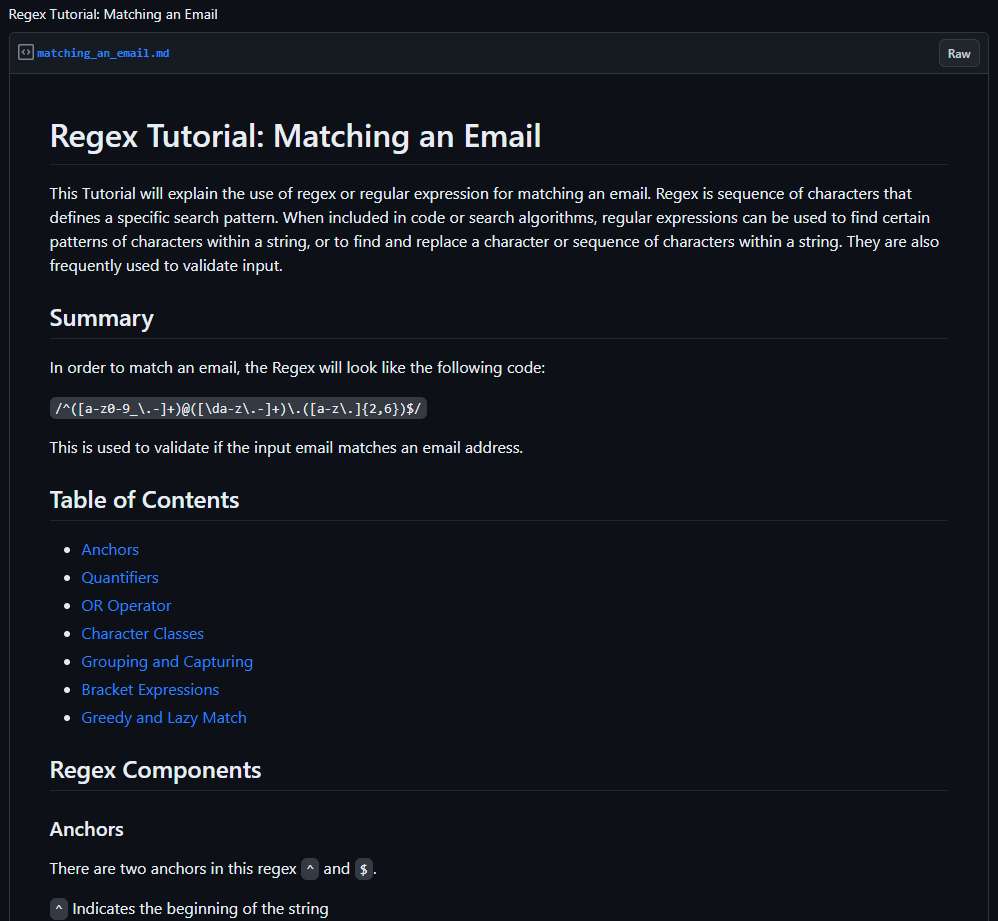

# Regex Tutorial: Matching an Email

  ## License: N/A
  

  ## Description:
  ### A tutorial explaining the use of regex or regular expression for matching an email. 

  ## Table of Contents
  ### * [License](#license)
  ### * [Installation](#installation)
  ### * [Assets](#assets)
  ### * [Usage](#usage)
  ### * [Contributing](#contributing)
  ### * [Tests](#tests)
  ### * [Questions](#questions)

  ## Installation:
  ### You must Install the following for this application to function:
    
  N/A
  ## Assets:

  ### Image of Gist: 

   

  ## Usage:
  ### A regex, which is short for regular expression, is a sequence of characters that defines a specific search pattern. When included in code or search algorithms, regular expressions can be used to find certain patterns of characters within a string, or to find and replace a character or sequence of characters within a string. They are also frequently used to validate input.

  ## Contributing:
  ### N/A

  ## Tests:
  ### Run the following in your terminal to test this application:
  ### N/A

  ## Questions:
  ### If you have any questions, contact me at
  ### GitHub: https://github.com/JerrickJohnson
  ### or
  ### Email: jerrickjohnson88@gmail.com